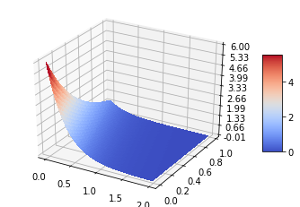

# Simple PyTorch Implementation of Physics Informed Neural Network (PINN)

This repository contains my simple and clear to understand implementation of the paper [1]. As an example, I solved the 1D heat partial differential equation.
### 3D plot of the solution to 1D Heat Equation. 


All the steps are included in a single file: `solve_PDE_NN.ipynb` which depends on the `pytorch` and `numpy` packages.

If you find this implementation useful, then please cite this work:
```
@software{Doloi_PyTorch_Implementation_of,
author = {Doloi, Nandita},
license = {MIT},
title = {{PyTorch Implementation of Physics Informed Neural Network (PINN)}}
}
```

This implementation was used in my following [paper](https://onepetro.org/SPERCSC/proceedings-abstract/22RCSC/1-22RCSC/D011S001R006/515732?redirectedFrom=PDF). Here is the citation:
```

@proceedings{10.2118/212611-MS,
    author = {Doloi, Nandita and Ghosh, Somnath and Phirani, Jyoti},
    title = "{Super-Resolution Reconstruction of Reservoir Saturation Map with Physical Constraints Using Generative Adversarial Network}",
    volume = {Day 1 Tue, January 24, 2023},
    series = {SPE Reservoir Characterisation and Simulation Conference and Exhibition},
    pages = {D011S001R006},
    year = {2023},
    month = {01},
    abstract = "{Complete physics-based numerical simulations currently provide the most accurate approach for predicting fluid flow behavior in geological reservoirs. However, the amount of computational resources required to perform these simulations increase exponentially with the increase in resolution to the point that they are infeasible. Therefore, a common practice is to upscale the reservoir model to reduce the resolution such that numerous simulations, as required, can be performed within a reasonable time. The problem we are trying to solve here is that the simulation results from these upscaled models, although they provide a zoomed-out and global view of the reservoir dynamics, however, they lack a detailed zoomed-in view of a local region in the reservoir, which is required to take actionable decisions. This work proposes using super-resolution techniques, recently developed using machine learning methods, to obtain fine-scale flow behavior given flow behavior from a low-resolution simulation of an upscaled-reservoir model. We demonstrate our model on a two-phase, deal-oil, and heterogenous oil reservoir, and we reconstruct the oil saturation map of the reservoir. We also demonstrate how the network can be trained using dynamic coarse geological properties at various resolutions. The findings imply that even when coarse geological features and with limited resolution, the super-resolution reconstructions are able to recreate missing information that is close to the ground facts.}",
    doi = {10.2118/212611-MS},
    url = {https://doi.org/10.2118/212611-MS},
    eprint = {https://onepetro.org/SPERCSC/proceedings-pdf/22RCSC/1-22RCSC/D011S001R006/3060766/spe-212611-ms.pdf},
}
```


[1] Raissi, Maziar, Paris Perdikaris, and George E. Karniadakis. "Physics-informed neural networks: A deep learning framework for solving forward and inverse problems involving nonlinear partial differential equations." Journal of Computational Physics 378 (2019): 686-707.
